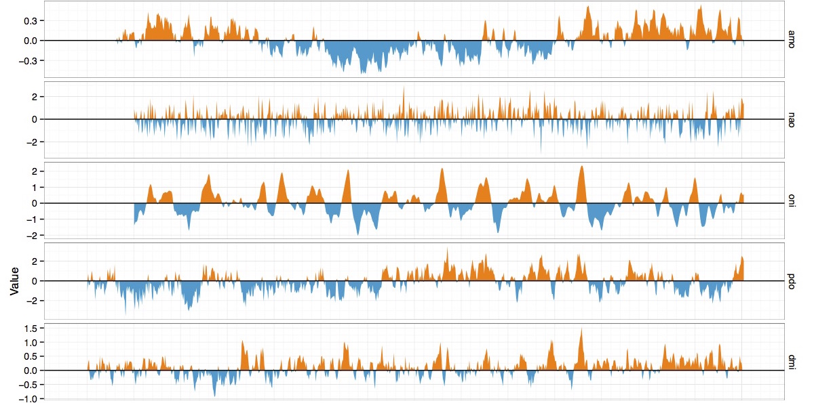

 

 

 

[ClimGrid <i class="fa fa-github"></i>](https://github.com/camposfa/ClimGrid) is an R package for obtaining and analyzing gridded climate data and global climate oscillation indices.

Additional functionality and documentation will be added soon.