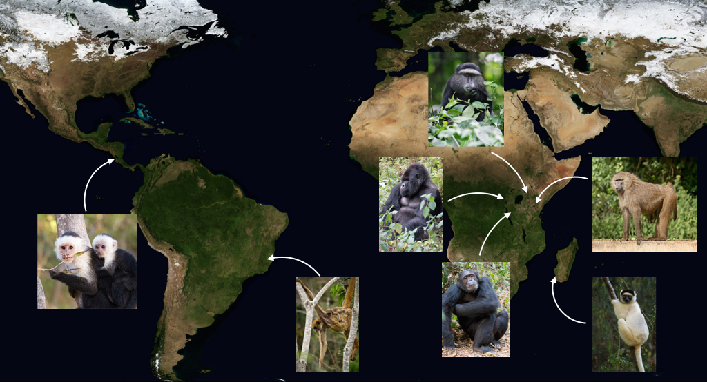

  

# [plhdbR <i class="fa fa-github"></i>](https://github.com/camposfa/plhdbR)

 

 

`plhdbR` is a collection of tools to work with data from the [Primate Life History Database](https://plhdb.org/) (PLHDB).

>Karen B. Strier, Jeanne Altmann, Diane K. Brockman, Anne M. Bronikowski, Marina Cords, Linda M. Fedigan, Hilmar Lapp, Xianhua Liu, William F. Morris, Anne E. Pusey, Tara S. Stoinski and Susan C. Alberts (2010). The Primate Life History Database: a unique shared ecological data resource. _Methods in Ecology and Evolution_, 1(2), 199–211. doi: [10.1111/j.2041-210X.2010.00023.x](http://doi.org/10.1111/j.2041-210X.2010.00023.x)

_There are no life history or fertility data included in this package._

To use the tools, you must have access to the PLHDB. The site is currently accessible for the working group members only.

`plhdbR` aims to facillitate the analysis of data in the PLHDB. It will contain three main sets of tools:

* Functions that make it easy to read the life history and fertility data into R for further analysis

* Functions for calculating vital rates

* Functions for retrieving and analyzing up-to-date climate data

